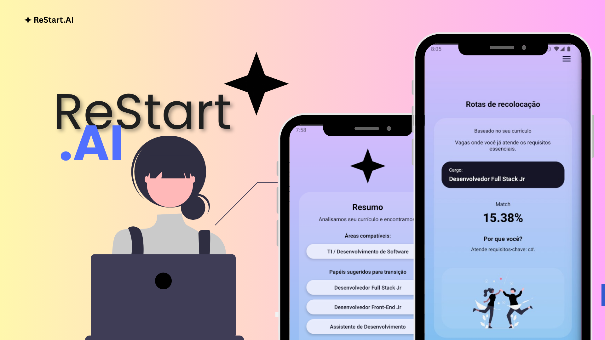

# ReStart.AI Mobile 📱✨

Aplicativo mobile desenvolvido para a Global Solution 2025-2, focado em apoiar pessoas em transição de carreira para tecnologia por meio da análise de currículos e geração de rotas de recolocação.

  

----------------------------------
### 1. Visão geral do projeto 🧩
O ReStart.AI Mobile é o front-end mobile do ecossistema ReStart.AI.  
Ele consome uma API hospedada em Azure para:

- Realizar login e cadastro de usuários
- Analisar o currículo do usuário (processado no backend)
- Retornar áreas compatíveis, papéis sugeridos e match de aderência
- Exibir rotas de recolocação e próximos passos

Tecnologias principais:

- React Native + Expo
- TypeScript
- Context API para gerenciamento de tema de fundo
- Integração com API .NET/Java (Azure)
- EAS Build (Expo Application Services)
- Firebase App (App Distribution) para distribuição da aplicação

----------------------------------
### 2. Funcionalidades principais ✅

🔐 Autenticação
- Tela de Login com validação de e-mail e senha
- Tela de Cadastro com:
  - Nome completo
  - CPF com máscara e validação básica
  - Data de nascimento com máscara (dd/mm/aaaa)
  - E-mail com validação
  - Senha com validação de tamanho
- Modo demonstração (fallback):
  - Caso a API não responda (erro de conexão), o app oferece a opção
    de entrar em modo demo com um usuário fictício.

👤 Perfil do usuário
- Tela “Meus dados” com layout em card minimalista (estilo janela).
- Campos carregados da API:
  - Nome completo
  - CPF
  - Data de nascimento
  - E-mail
- Possibilidade de edição dos dados com feedback de carregamento.
- Ações:
  - Editar / Salvar dados
  - Apagar conta
  - Sair da conta
- Botões estilizados com ícones (editar, salvar, sair, excluir).

🧠 Resumo de perfil
- Tela de Resumo que consome `/api/usuarios/me/resumo-perfil`.
- Exibição de:
  - Áreas compatíveis
  - Papéis sugeridos para transição
- Uso de chips estilizados para listar áreas e papéis.
- Fallback:
  - Se a API falhar, mostra áreas e papéis padrão (mock) para manter a experiência.
- Botão “Próximos passos” que envia o usuário para a tela de Rotas com o `usuarioId`.

🧭 Rotas de recolocação
- Tela “Rotas de recolocação” com card translúcido.
- Informações mostradas:
  - Cargo sugerido (BestRole)
  - Match em %
  - Texto “Por que você?” trazendo o motivo retornado pela API
- Tratamento de dados:
  - Lê tanto propriedades em camelCase quanto PascalCase (ex.: `bestRole` / `BestRole`).
  - Se o Match vier inválido ou ausente:
    - Usa um valor padrão amigável.
- Fallback:
  - Se a API falhar, mostra:
    - Cargo padrão
    - Match fixo
    - Texto explicativo
- Ilustração usando componente `People`.

⭐ Sobre o app
- Tela “Sobre o app” com layout inspirado em janela de sistema:
  - Cabeçalho com três pontos coloridos (vermelho, amarelo, verde).
  - Card translúcido centralizado com:
    - Nome do app
    - Versão
    - Plataforma
    - Tecnologias principais
    - Hash do commit atual
- Hash do commit:
  - Lido dinamicamente via `app.config.ts` usando dados do repositório Git.
  - Exibido na tela via `expo-constants` (`extra.commitHash`).

----------------------------------
### 3. Integrações externas ☁️

🌐 API ReStart.AI (Azure)
- Cliente HTTP configurado com Axios:
  - `baseURL`: https://restartai-api-001.azurewebsites.net/swagger/index.html
  - Timeout configurado para evitar travamentos
  - Header com `x-api-key` para autenticação da API 
  - dev-swagger-key-123
----------------------------------
### 4. Como rodar o app localmente 🛠️

Pré-requisitos:
- Node.js LTS
- Expo CLI (via `npx`)
- Android Studio / Emulador ou dispositivo físico
- Yarn ou npm

Passos:

1. Instalar dependências:
   - `npm install`
   - ou `yarn`

2. Rodar em modo desenvolvimento com Expo Go:
   - `npm start`
   - ou `yarn start`
   - Abrir no emulador Android com a tecla `a` ou escaneando o QR Code no app Expo Go.

3. Rodar com build nativo (prebuild local opcional):
   - `npx expo prebuild -p android`
   - `cd android && ./gradlew assembleDebug`

----------------------------------
### 5. Links importantes 🔗

🎬 Vídeo de demonstração  
Link: https://youtu.be/C_S6TsNUuNE

📦 Download do APK  
Link: https://expo.dev/artifacts/eas/jAiFNaRx2sAqoFZb2yw7R7.apk

----------------------------------
### Equipe 👥

* ⭐️ **Valéria Conceição Dos Santos** — RM: **557177**  
* ⭐️ **Mirela Pinheiro Silva Rodrigues** — RM: **558191**

----------------------------------

